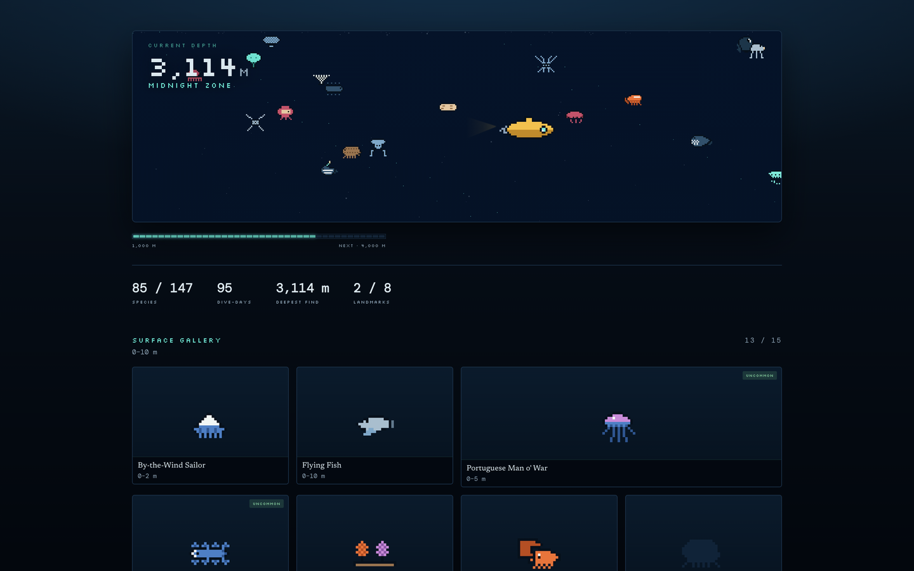
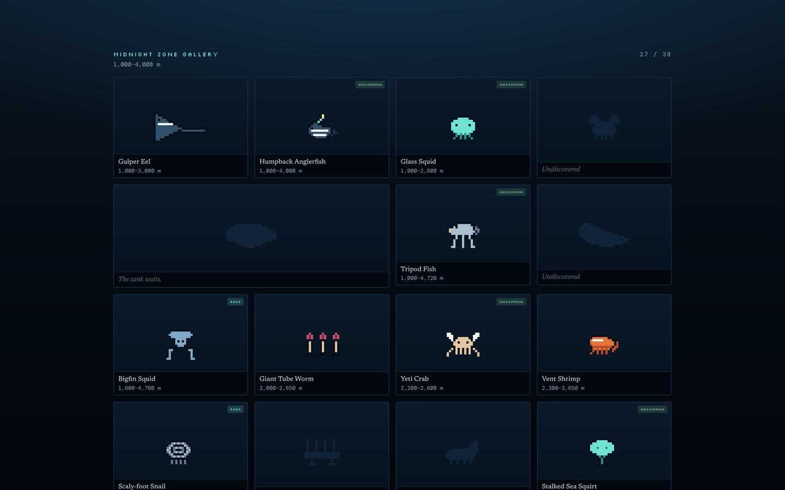
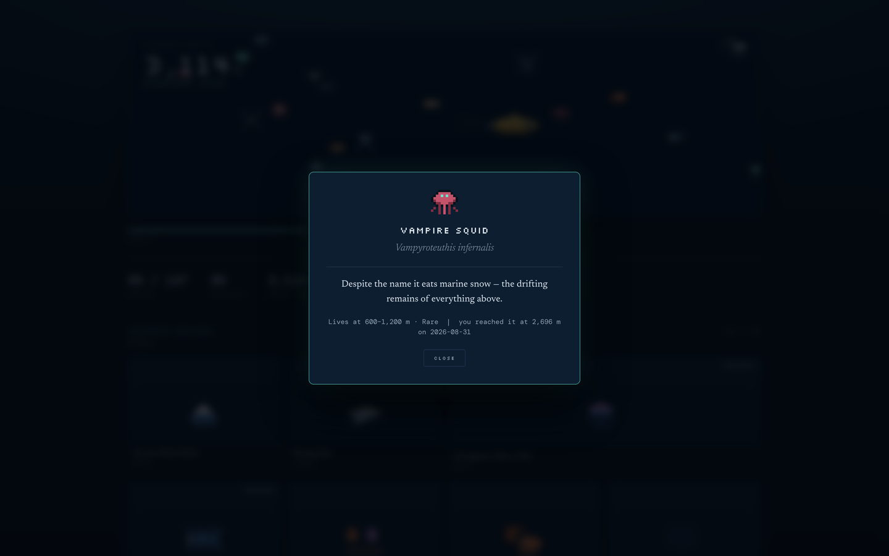
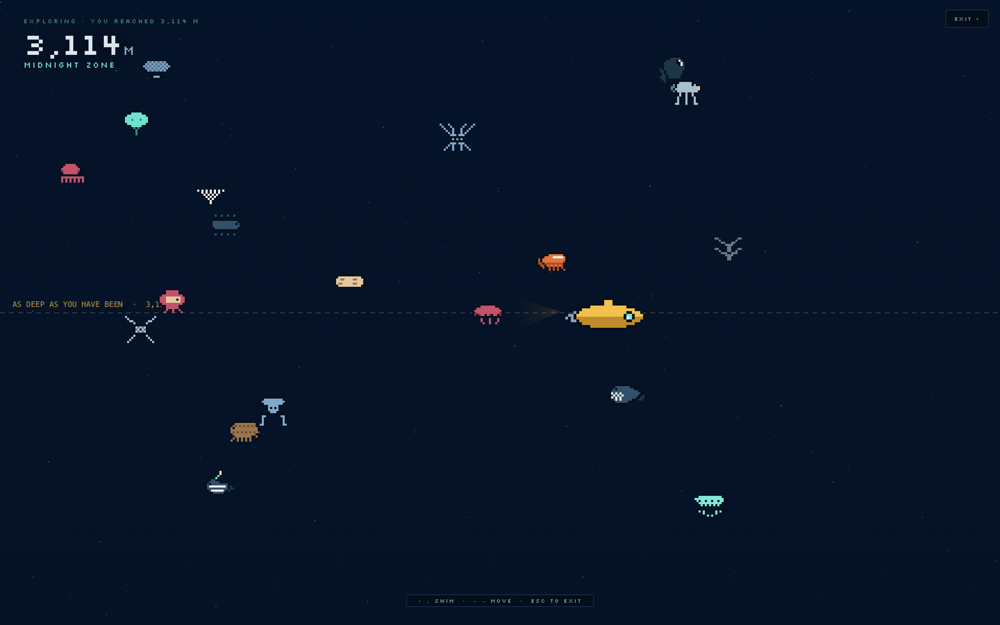
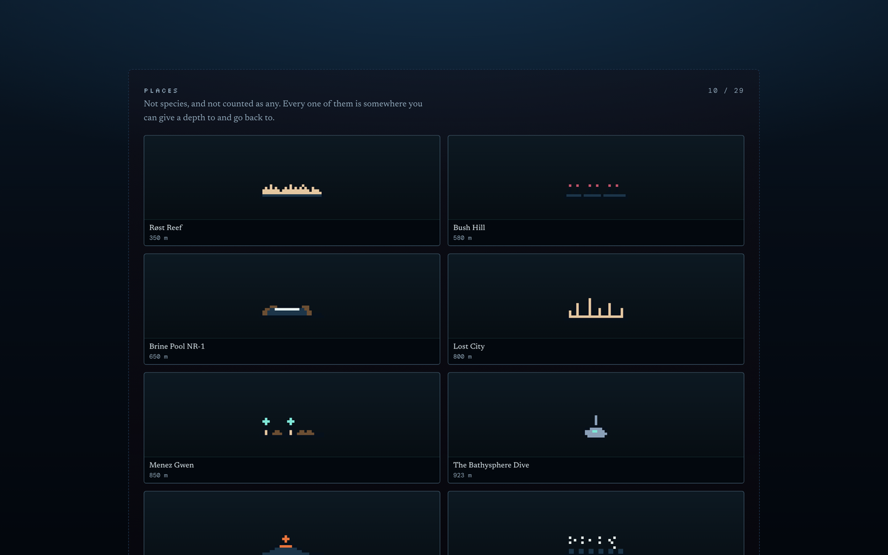

# 🌊 TokenDive

**Every token takes you deeper.**

TokenDive turns the coding-agent usage already sitting on your disk into an
ocean expedition. You keep coding; a submarine keeps descending. Somewhere
around 1,000 m the water goes black and things start to glow.

It lives in your macOS menu bar. It never interrupts you. Once in a while it
tells you something surfaced.

---



## Not released yet

There is nothing to download here today. This page exists so there is somewhere
to ask questions and report problems before there is.

**Watch this repository** to hear when there is a build. It will be a signed,
notarised `.dmg` on the [Releases](../../releases) page — drag it to
Applications and that is the whole install.

## What it does

**Depth instead of numbers.** `1,519 m · Midnight Zone` means more than
`412,883,109 tokens`, which is the point. Depth accumulates day by day and never
goes backwards.

**A daily cap, so burning tokens is pointless.** Past a per-day ceiling, extra
tokens buy zero depth. The real axis of progression is *days you showed up*, not
tokens spent. The ceiling opens over the minutes you actually work, so the
number moves through a session instead of arriving all at once — and a day's
worth of tokens spent in four minutes is still four minutes.

**Species you find, not levels you grind.** 147 marine species across nine
zones, each at its real depth, each with a fact worth reading and more of them
the second time you meet it. Every scientific name is checked against
[WoRMS](https://marinespecies.org) and every depth comes from
[OBIS](https://obis.org) occurrence records rather than from what would have
been convenient. You cannot meet an anglerfish in a coral reef.

**And 29 places.** A brine pool with a shoreline at 2,200 m. The Titanic at
3,800 m. The deepest wreck ever surveyed, at 6,469 m. The spot off Bermuda
where two men were lowered on a cable in 1934 and became the first people to
see the deep sea alive. Below 8,400 m nothing described has its shallow limit,
so down there a place is the only thing left to find — they are counted
separately, because a shipwreck is not a species.

**And it ends.** There is a bottom, about a year of real use away. What happens
when you get there is deliberately not written down here.

## What it looks like

The museum fills in as you go. Everything you have not met yet is a silhouette,
and the shape waiting in the tank is most of the reason to keep going.



Click an animal and it tells you what it is, where it lives, and where *you*
were when you found it.



Or go down and swim around at whatever depth you have reached.



Places are kept in their own room.



> These are from a run part way down — 85 species of 147, 3,114 m — built by
> putting invented usage through the real engines, so every number on the page
> is an outcome of the shipped rules. Nobody's actual museum is on display here.

## What it reads

Four locations, all on your own machine:

| Agent | Where |
|---|---|
| Claude Code | `~/.claude/projects` |
| Codex CLI | `~/.codex/sessions` |
| Cursor | `~/Library/Application Support/Cursor` |
| Pi agent | `~/.pi/agent` |

From those files it takes **token counts and timestamps, and nothing else**.
Prompts and code are dropped where the file is parsed: the internal record has
no field that can hold text.

macOS will not ask you to approve any of this, because those paths are not the
kind the system protects. That is worth knowing rather than being reassured by —
**any app you run outside the App Store can read them without asking.** So the
claims here are built to be checked instead.

## What it sends

Nothing. The app contains no HTTP client at all — no `urllib.request`, no
`http`, no TLS library — which you will be able to confirm on a copy you have
downloaded, without trusting anybody:

```
unzip -l /Applications/TokenDive.app/Contents/Resources/lib/python311.zip \
  | grep -cE 'urllib/request|http/|ssl'
```

That prints `0`. A firewall such as [LuLu](https://objective-see.org/products/lulu.html)
will tell you the same thing from outside: no outbound connections, ever.

The app says all of this about itself too, under **What TokenDive reads…** in
its own menu — generated from the code that does the reading, rather than typed
out beside it.

Everything it writes lives in `~/.tokendive`.

## Something wrong, or something to say

[Open an issue](../../issues). If a number looks wrong, the menu has
**Diagnostics…**, which copies a short report — version, what logs it found,
what it computed. No prompts, no file names, no paths beyond the four above. It
is meant to be pasted in public.

## Terms

Free to use, and not open source. Copyright © 2026 kaychak. All rights
reserved.

THE SOFTWARE IS PROVIDED "AS IS", WITHOUT WARRANTY OF ANY KIND, EXPRESS OR
IMPLIED. IN NO EVENT SHALL THE AUTHOR BE LIABLE FOR ANY CLAIM, DAMAGES OR OTHER
LIABILITY ARISING FROM THE SOFTWARE OR THE USE OF IT.

The full terms ship with the app.
